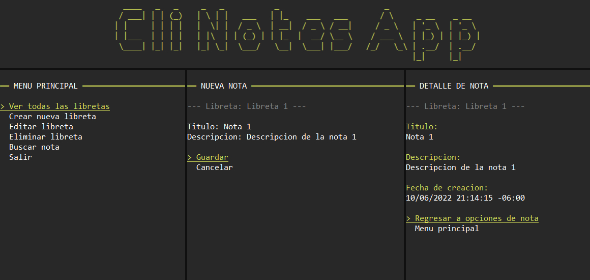

# Cli Notes App

Aplicación de consola para gestionar notas sencillas, agrupadas en libretas, que permite hacer las operaciones CRUD típicas. Está desarrollada con .Net 6, las notas y libretas son almacenadas en una base de datos de Supabase, utiliza la librería supabase-csharp para la conexión con los servicio de Supabase, y se usa la librería Spectre.Console para los elementos visuales de la aplicación.




## Tecnologías usadas
### Frameworks y librerías

- [.NET 6 (SDK v6.0.300)](https://docs.microsoft.com/es-mx/dotnet/fundamentals/)
- [Spectre.Console](https://spectreconsole.net/)
- [supabase-csharp](https://github.com/supabase-community/supabase-csharp)

### Servicios

- [Supabase](https://supabase.com/)

## Getting started

Para el almacenamiento de los datos es necesario tener un proyecto en Supabase (Cuentan con un plan gratuito de hasta 2 proyectos). Una vez creado el proyecto, ejecuta los siguientes scripts en el Editor SQL de la plataforma para crear las tablas necesarias:
- Para libretas:
```sql
    CREATE TABLE public.notebooks
    (
        id uuid NOT NULL DEFAULT uuid_generate_v4(),
        created_at timestamp with time zone DEFAULT now(),
        name text COLLATE pg_catalog."default",
        CONSTRAINT notebooks_pkey PRIMARY KEY (id)
    )
```
- Para notas:
```sql
    CREATE TABLE public.notes
    (
        id uuid NOT NULL DEFAULT uuid_generate_v4(),
        created_at timestamp with time zone DEFAULT now(),
        title text COLLATE pg_catalog."default",
        description text COLLATE pg_catalog."default",
        notebook_id uuid,
        CONSTRAINT notes_pkey PRIMARY KEY (id),
        CONSTRAINT notes_notebook_id_fkey FOREIGN KEY (notebook_id)
            REFERENCES public.notebooks (id) MATCH SIMPLE
            ON UPDATE NO ACTION
            ON DELETE CASCADE
    )
```
Con la base de datos lista, clona el repositorio y restaura los paquetes:
1. `git clone https://github.com/HDMC3/cli-notes-app.git`
2. `cd cli-notes-app`
3. `dotnet restore`

Por último, es importante configurar como secretos de usuario la URL y la API Key del proyecto de Supabase (se pueden encontrar en el apartado de "API" de la configuración del proyecto en el panel de proyecto de Supabase):

4. `cd Cli`
5. `dotnet user-secrets init`
6. `dotnet user-secrets set "DB:url" "aqui la url de tu proyecto"`
7. `dotnet user-secrets set "DB:key" "aqui la api-key de tu proyecto"`
8. `dotnet run`